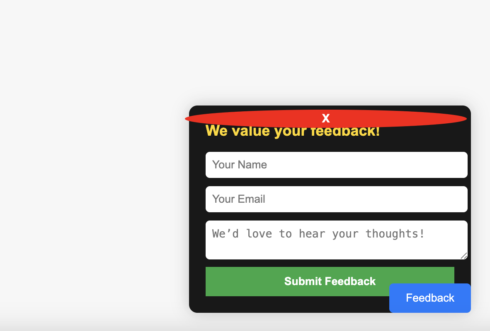

# Day 21 - Website Feedback Popup Form

## 📌 Project Overview
The **Website Feedback Popup Form** is a user-friendly feedback form that appears as a pop-up on a webpage, allowing visitors to provide valuable insights and comments. The form integrates with **EmailJS** to send feedback directly to an email inbox without requiring a backend.

## ✨ Features
- 🖱️ **Popup trigger button** to open the form
- 🎨 **Modern and responsive UI** with a dark-themed popup
- 📩 **EmailJS integration** to send feedback without a backend
- 🔥 **Smooth animations** for a better user experience
- ✅ **Success message display** after submission
- ❌ **Close button** to dismiss the popup

## 📂 Technologies Used
- **HTML** - Structure of the feedback form
- **CSS** - Styling for a sleek, modern look
- **JavaScript** - Form interactions & EmailJS integration
- **EmailJS** - Sending feedback emails seamlessly

## 🚀 How to Use
1. **Clone the repository** (if applicable) or copy the files into your project.
2. **Include EmailJS script** in your project:
   ```html
   <script src="https://cdn.jsdelivr.net/npm/@emailjs/browser@3/dist/email.min.js"></script>
   ```
3. **Initialize EmailJS** with your **Public Key**:
   ```js
   emailjs.init("your-public-key-here");
   ```
4. **Replace the service and template IDs** in the `sendFeedback` function:
   ```js
   emailjs.send("your-service-id", "your-template-id", feedbackData)
   ```
5. **Test the form** by filling it out and submitting feedback!

## 🔧 Setup Instructions
1. **Download or copy** the provided code.
2. **Sign up for EmailJS** and get your Public Key, Service ID, and Template ID.
3. **Modify the JavaScript file** with your EmailJS credentials.
4. **Embed the form in your website** and customize it as needed.

# Demo page

Click [Here](https://ayshasanyang.github.io/Day-21-Website-Feedback-Popup-Form/) to view the page

## 🚀 How to Run
1. Download or clone the repository
```bash
git clone https://github.com/ayshasanyang/Day-21-Website-Feedback-Popup-Form.git
```
2. Navigate to the project folder.
3. Open the project files in your vscode or any code editor of your choice
4. Open the `index.html` file in your web browser.

---

## 📸 Preview


---
Made with ❤️ by [AYSHA] 🚀